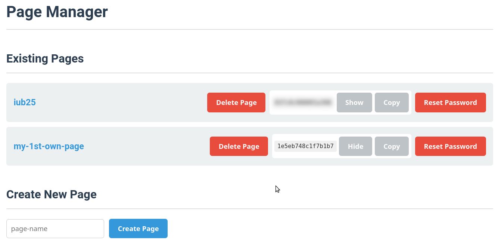
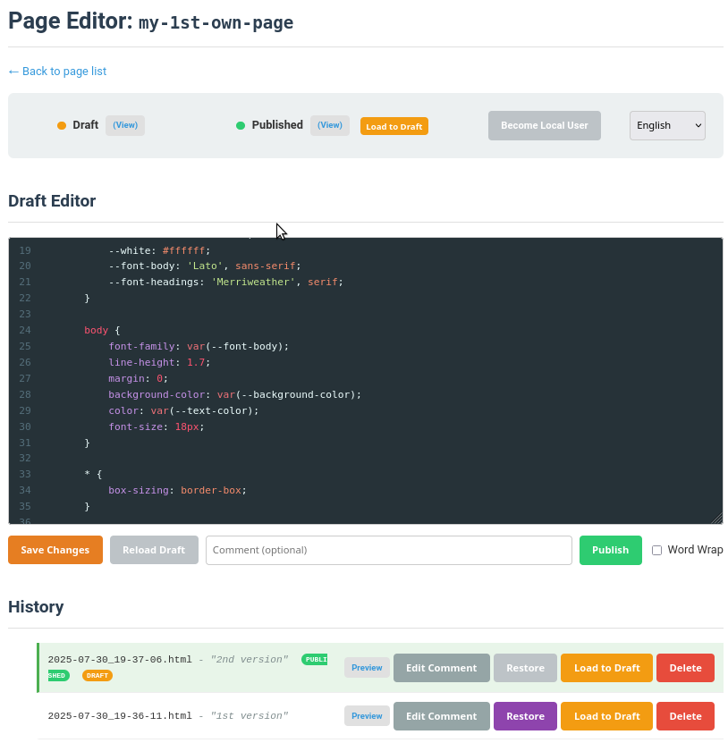

# Pages - A Simple Flat-File CMS

## Overview

"Pages" is a lightweight, single-file, flat-file Content Management System (CMS) written in PHP. It allows you to create, edit, and manage simple static HTML pages directly from your web browser without needing a database. It's designed for scenarios where you need a quick and secure way to manage a single pages ("all in one page") of content.


## Features

*   **No Database Required:** All content, history, and configuration are stored in files and directories.
*   **Secure Access:**
    *   Global admin password to manage all pages.
    *   Optional, unique passwords for each individual page, allowing you to delegate editing.
*   **Rich In-Browser Editor:** Uses CodeMirror for a pleasant HTML editing experience with syntax highlighting.
*   **Draft & Publish Workflow:** Work on a draft version of your page and publish it only when it's ready. The live page is never broken.
*   **Automatic Version History:** Every time you publish, a timestamped version of the page is saved. You can add comments to each version.
*   **Restore & Preview:** Easily preview, load into the draft, or restore any historical version.
*   **Safe Deletion:** Deleted pages are moved to a `trash` directory instead of being permanently removed, allowing for manual recovery.
*   **Multi-language UI:** The editor interface is available in multiple languages (English, Italian, French, Spanish, Portuguese).

## Requirements

*   A web server with PHP support (e.g., Apache, Nginx).
*   Write permissions for the web server user in the main `pages` directory to allow creating content and trash folders.

## Installation

1.  **Download Dependencies (CodeMirror):** This project uses the CodeMirror library for the in-browser editor. You need to download it before uploading the project to your server.

    *   Download the zip file from: `https://codemirror.net/5/codemirror.zip`
    *   Unzip the downloaded file. It will create a directory named something like `codemirror-5.65.19`.
    *   From inside the unzipped directory, copy the `lib/`, `theme/`, and `mode/` folders to the root of the `pages` project directory.
    *   You can now delete the downloaded zip file and the `codemirror-*` folder.

    > **Note:** For convenience, if you are on a Linux or macOS system with `wget` and `unzip` installed, you can simply run the `configure.sh` script included in the project. It will download and set up CodeMirror for you automatically. The script will also generate an initial `pwd.secret` file.

2.  **Upload Files:** Once CodeMirror is set up, copy the entire `pages` directory and its contents to your web server.

3.  **Create Admin Password:** In the root of the `pages` directory (the same location as `index.php`), create a file named `pwd.secret`. Inside this file, place your desired admin password on a single line. (You can skip this if you used the `configure.sh` script).

    ```bash
    echo "your-super-secret-admin-password" > pwd.secret
    ```

4.  **Set Permissions:** Ensure your web server has permission to create and write to directories within the `pages` folder. The application will automatically create `html/` (for content) and `trash/` directories on its first run if they don't exist.

    ```bash
    # On Linux, if needed, grant permissions to the web server user (e.g., www-data)
    chown -R www-data:www-data .
    chmod -R 755 .
    ```

5.  **Access:** You're ready to go! Open your browser and navigate to `https://your-domain.com/path/to/pages/index.php`. You will be prompted for a password.

## Usage

See the screenshots below for a visual guide of the main interfaces.

### 1. Page Manager (Admin View)

This is the main dashboard for managing all your pages.

*   **Access:** Navigate to `index.php` and provide your admin password in the `pwd` URL parameter:
    `https://.../pages/index.php?pwd=YOUR_ADMIN_PASSWORD`

*   **Features:**
    *   **View Existing Pages:** A list of all created pages. Click on a page name to go to its editor.
    *   **Create New Page:** Enter a name for a new page and click "Create".
    *   **Delete Page:** Move an entire page and its history to the trash.
    *   **Manage Page Passwords:** Generate a unique password for a page or reset it. This allows non-admin users to edit a specific page without having access to the main manager.

### 2. Page Editor

This is where you edit the content of a specific page.

*   **Access:**
    *   **With Admin Password:** `https://.../pages/index.php?pwd=YOUR_ADMIN_PASSWORD&page=your-page-name`
    *   **With Page-Specific Password:** `https://.../pages/index.php?pwd=PAGE_PASSWORD&page=your-page-name`

*   **Interface:**
    *   **Status Bar:** Shows the status of the current draft and the published version. You can quickly preview them or load the published version back into the draft.
    *   **Draft Editor:** The main CodeMirror text area where you edit your HTML content.
    *   **Actions:**
        *   **Save Draft:** Saves your current work without making it public. The editor will warn you if you try to leave with unsaved changes.
        *   **Publish:** Saves the current draft, copies it to the live `index.html` file, and creates a timestamped version in the history. You can add an optional comment to describe the changes.
    *   **History:** A list of all previously published versions. From here you can:
        *   **Preview:** View a historical version.
        *   **Edit Comment:** Change the comment for a version.
        *   **Restore:** Overwrite the currently *published* page with this historical version.
        *   **Load to Draft:** Copy the content of a historical version into the draft editor to use it as a starting point for new changes.
        *   **Delete:** Remove a specific historical version.

### 3. Screenshots

**Page Manager View**

*The main dashboard to create, delete, and manage pages and their passwords.*



---

**Page Editor View**

*The editor for a single page, showing the draft area, status bar, actions, and version history.*



## Directory Structure

The application maintains a simple directory structure:

*   `html/`: Contains a subdirectory for each page you create.
    *   `html/page-name/`:
        *   `index.html`: The live, published version of the page.
        *   `draft.html`: The current draft.
        *   `YYYY-MM-DD_HH-MM-SS.html`: Historical versions.
        *   `YYYY-MM-DD_HH-MM-SS.comment`: Comments for historical versions.
        *   `pwd.secret`: The optional page-specific password.
*   `trash/`: Deleted pages are moved here, timestamped to avoid name conflicts.
*   `lang/`: Contains translation files for the UI.
*   `lib/`, `theme/`, `mode/`: Contain the CodeMirror editor library and its assets.
*   `index.php`: The main application file.
*   `pwd.secret`: The admin password file.

## Security Considerations & Future Improvements

*   **Login Form:** The current method of passing the password via a `GET` parameter is insecure. A future version should implement a proper login form using the `POST` method.
*   **Password Hashing:** Passwords are currently stored in plain text. For better security, they should be hashed before being stored.